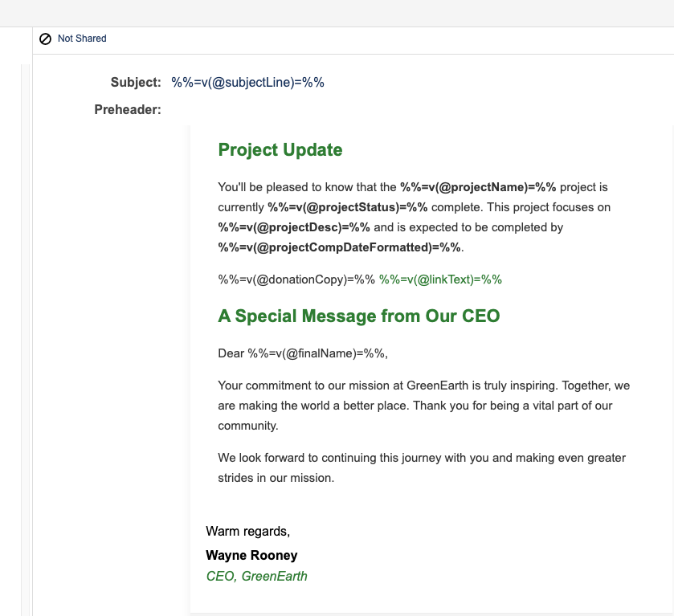
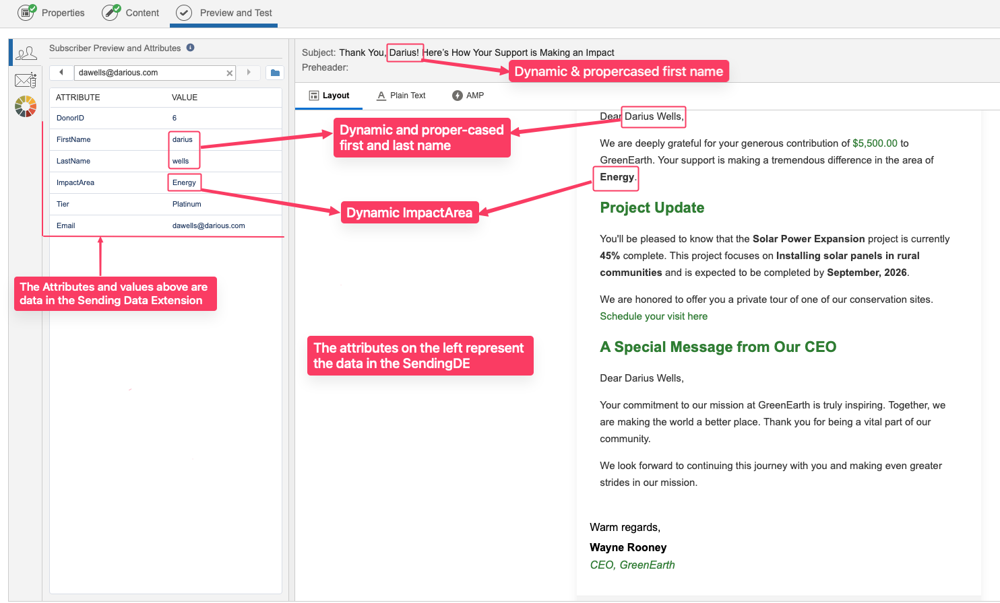
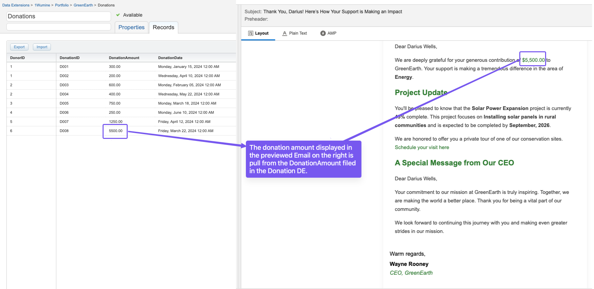
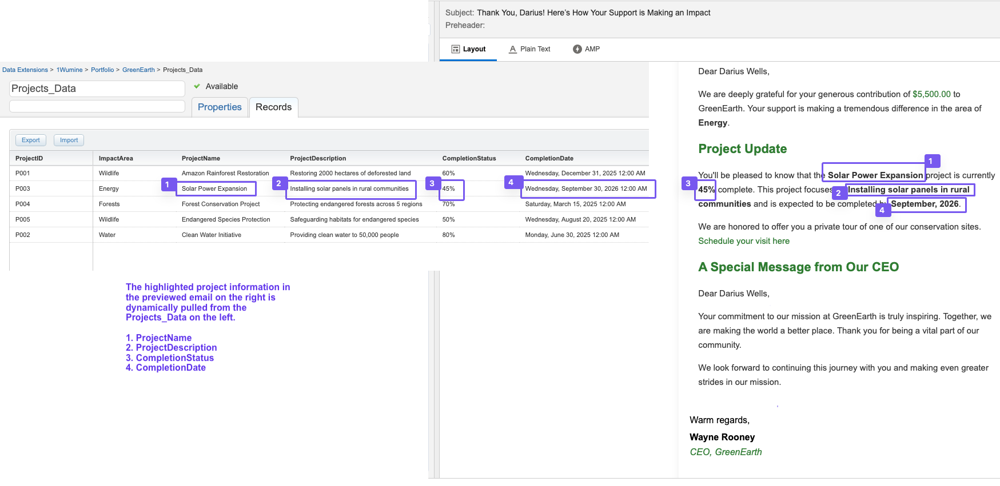
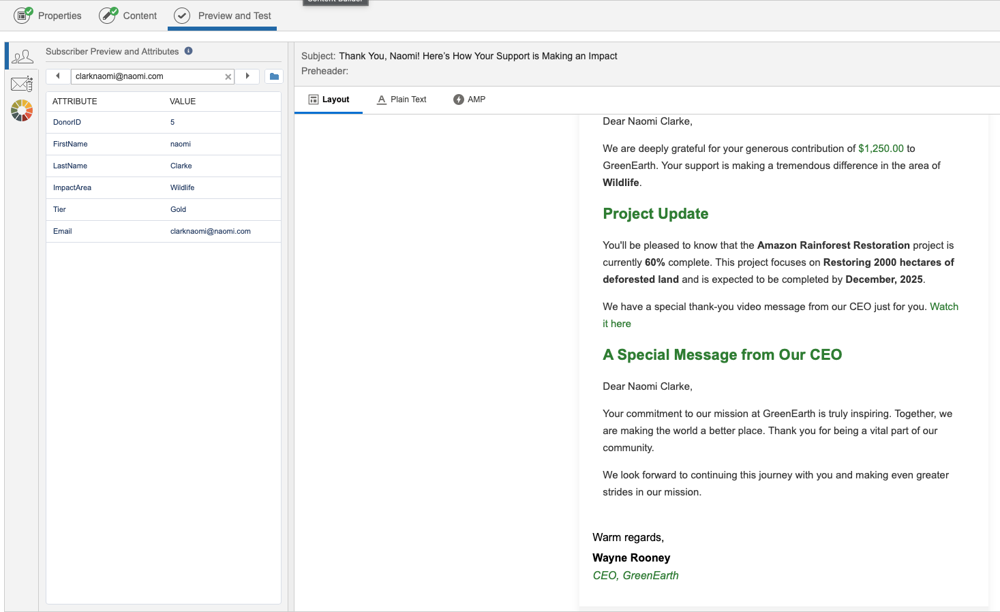

# GreenEarth Personalized Thank-You Email

## Project Overview

This project involves creating a personalized thank-you email for **GreenEarth** using **Salesforce Marketing Cloud (SFMC)**. The email dynamically adjusts content based on the donor's contribution tier and includes an impact report highlighting specific projects supported by the donor's funds.

---

## Scenario

GreenEarth wants to send out a personalized thank-you email that includes a detailed impact report based on specific projects the donor's funds have supported.

The email changes dynamically based on the donor's total contribution amount, with different messages and additional perks for high-tier donors.

The total donation amount is calculated by summing the donations from multiple records in a separate data extension.

---

## Requirements

### Personalization

- Greet the donor by their **first name**.
- Calculate the total donation amount by summing records from a separate data extension.
- Include the **total donation amount** in the email.
- Dynamically insert a **personalized thank-you message** based on the amount donated by the donors.

### Dynamic Thank-You Messages

| **Total Donation Amount** | **Message** |
|---------------------------:|-------------|
| **< 500** | We appreciate your support. Every bit of your contribution counts. |
| **500 - 1000** | As a token of our appreciation, we would like to invite you to an exclusive donor event. Click here to learn more. |
| **1000 - 5000** | We have a special thank-you video message from our CEO just for you. Watch it here. |
| **> 5000** | We are honored to offer you a private tour of one of our conservation sites. Schedule your visit here. |

### Data Transformation

- Ensure **names are properly capitalized**.
- **Format donation amounts** with currency symbols.
- **Format event dates** appropriately.

### Dynamic Content

- Dynamically adjust content based on the donor’s tier.
- Include project completion messages with **specific percentages** and **completion statuses** for ongoing projects.

---

## AMPscript Features

- Personalization
- Conditional Messaging
- Data Transformation
- Dynamic Content

---

## Email Preview Walkthrough
Here are the previews of the dynamic Thank-You email:

---

---

---

---

---

## 👩‍💻 Author
**Wunmi Ogunbekun**

